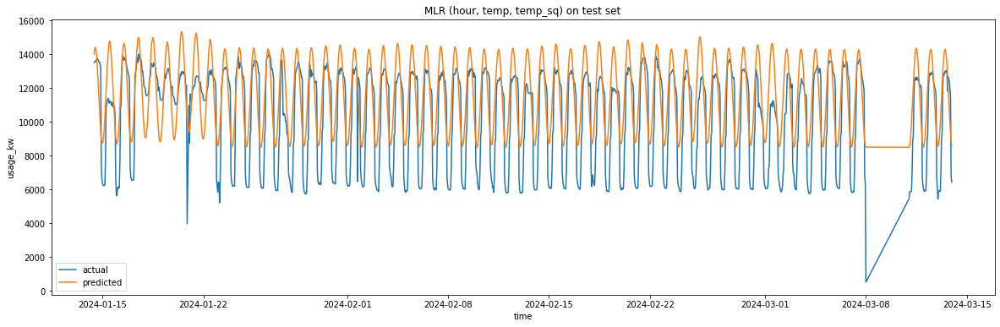

# Boston Public Library energy usage prediction

Being conscious of our energy consumption is important for the future health of our planet. In this project, I'm going to try to understand the energy usage patterns of the Boston Public Library (Central branch). The aim is to find an interpretable regression model for the library's energy consumption.

I will be combining two datasets. The first dataset from [boston.gov](https://data.boston.gov/dataset/central-library-electricity-usage) gives energy usage information for the Boston Public Library (Central branch). The second dataset was obtained using [Meteostat's API](https://dev.meteostat.net/python/hourly.html), which gives hourly data on the weather in Boston. I'll be using the data from January 2023 to March 2024.

After cleaning and combining the datasets, I wanted to explore the relationship between the variables. Since I'm looking for an interpretable linear regression model, I want to find linear relationship or possibly transformations that create linear relationships. It seemed like the hour of the day and the temperature explained most of the variation in energy consumption. Adding more variables to the model did not improve the performance of the model. Therefore, I arrived at the final model

$$y = -2894.79\cos\left(\frac{h}{12}\right) + 4.103(T-6.025)^2 + 11395.084,$$
where $y$ is the energy usage for the hour in kWh, $h$ is the hour of the day on a 24 hour scale, and $T$ is the temperature in degrees Celcius. 

The following is how this model performs for the test set (Jan 2024 - March 2024). 

